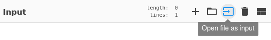

## CyberChef Recipe for GIF File Comment: [cyberchef_gifcomment.md](https://gist.github.com/nomuus/32147f2a12595ad844067c83f0c6ef51)
Cyberchef Recipe to View Raw Hex Bytes of GIF Comment.

### Examples

#### Download sample GIF, set comment using [exiftool](https://exiftool.org/), and then manually open the file from the recipe.

1) Download sample GIF

    ```
    wget https://media.giphy.com/media/kHGxZUxfTTInkeybFo/giphy-downsized.gif
    ```

2) Set comment using [exiftool](https://exiftool.org/)

    ```
    exiftool "-Comment=$(printf '\x6e\x65\x76\x65\x72\x20\x67\x6f\x6e\x6e\x61\x20\x67\x69\x76\x65\x20\x79\x6f\x75\x20\x75\x70\x21')" giphy-downsized.gif
    ```

3) Manually open the [sample GIF file](./img/cyberchef_giphy-downsized.gif) from the recipe.

    

Result:

